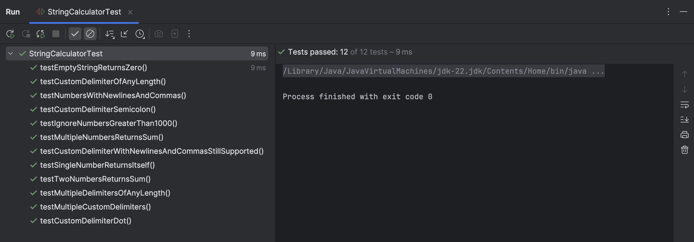

# 🧮 String Calculator – TDD Java Project

This project is a **Test-Driven Development (TDD)** implementation of a `StringCalculator` in Java. It solves a progressive set of string-based parsing problems while following clean, incremental design principles.

## 🚀 Features Implemented

- ✅ Returns `0` for an empty string
- ✅ Adds numbers separated by commas (e.g., `"1,2"` → `3`)
- ✅ Supports newline (`\n`) as a delimiter (e.g., `"1\n2,3"` → `6`)
- ✅ Supports **custom single-character delimiters** (`"//;\n1;2"` → `3`)
- ✅ Supports **multi-character delimiters** (`"//[***]\n1***2***3"` → `6`)
- ✅ Supports **multiple delimiters** (`"//[*][%]\n1*2%3"` → `6`)
- ✅ Supports **multiple long delimiters** (`"//[***][%%]\n1***2%%3"` → `6`)
- ✅ Ignores numbers > 1000 (e.g., `"2,1001"` → `2`)

---

---

## 📸 Screenshot

> 📷 Replace with your actual screenshot file (e.g. `screenshot.png`):
  

---

